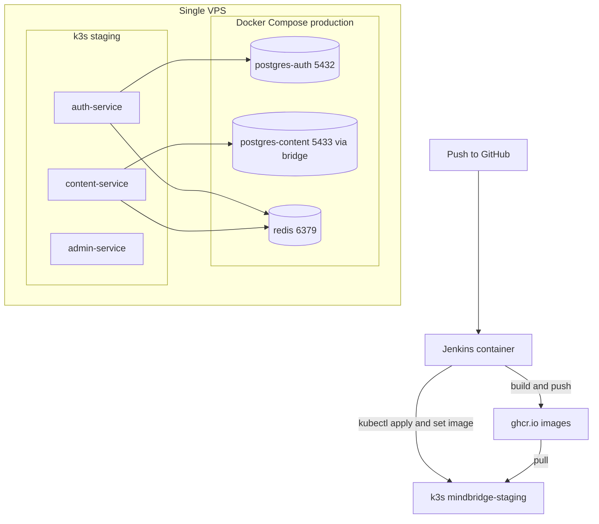

# k3s Staging + Jenkins CI/CD Runbook

This runbook covers the lightweight k3s staging lane and the Jenkins CI/CD
pipeline. Production continues to run on Docker Compose
(`infra/docker/docker-compose.prod.yml`); nothing here changes the production
runtime.

## Scope

- k3s runs on the same VPS, Traefik and metrics-server disabled, so it does not
  claim ports 80/443 (owned by the Compose Nginx gateway).
- Three staging services run in k3s: `auth-service`, `content-service`,
  `admin-service`.
- Postgres and Redis stay in Docker Compose. k3s pods reach them over the Docker
  bridge gateway (default `172.17.0.1`).
- Jenkins runs as a standalone Docker container on the VPS and deploys to k3s.

## Architecture



## One-time setup

### 1. Install k3s

```bash
cd infra/ansible
ansible-playbook playbooks/k3s.yml --ask-vault-pass
```

### 2. Publish the Compose databases to the bridge

Confirm the bridge gateway IP, then start the DBs/Redis with the override:

```bash
ip -4 addr show docker0            # usually 172.17.0.1
cd infra/docker
docker compose \
  -f docker-compose.prod.yml \
  -f docker-compose.k3s-bridge.yml \
  --env-file .env.prod up -d postgres-auth postgres-content redis
```

If the gateway is not `172.17.0.1`, set `K3S_BRIDGE_HOST` in `.env.prod` and
update the same value in the staging patches under
`infra/k8s/overlays/staging/`.

### 3. Create the staging secrets (no plaintext in git)

```bash
cd infra/k8s/overlays/staging
cp staging-secrets.env.example staging-secrets.env   # fill in real values (git-ignored)
export $(grep -v '^#' staging-secrets.env | xargs)
./create-secrets.sh
```

This creates `app-secrets`, `postgres-secrets`, and `ghcr-pull-secret` in the
`mindbridge-staging` namespace.

### 4. Set your GitHub org

Edit the image org in two places to your lowercase GitHub org/user:

- `infra/k8s/overlays/staging/kustomization.yaml` (`YOUR_GH_ORG`)
- `Jenkinsfile` (`GH_ORG`)

### 5. Provision Jenkins

```bash
cd infra/ansible
ansible-playbook playbooks/deploy.yml --ask-vault-pass   # ensures repo is on the VPS
ansible-playbook playbooks/jenkins.yml --ask-vault-pass
```

Reach the UI through an SSH tunnel (it is bound to loopback):

```bash
ssh -L 8080:127.0.0.1:8080 deploy@<vps>
# open http://localhost:8080
```

In Jenkins, add a Username/Password credential `ghcr-credentials` (GitHub user +
a PAT with `write:packages`), then create a Pipeline job pointing at this repo's
`Jenkinsfile`.

## Deploying

Push to the tracked branch (or run the job manually). The pipeline:

1. Checks out the repo.
2. Runs frontend lint/build/test.
3. Builds each service image and runs `manage.py check` as a smoke test.
4. Builds and pushes images to GHCR (`:<commit>` and `:staging`).
5. `kubectl apply -k infra/k8s/overlays/staging`, then `set image` to the commit
   tag and waits for rollout.
6. Health-checks each service via its NodePort.

Manual deploy without Jenkins:

```bash
kubectl apply -k infra/k8s/overlays/staging
kubectl -n mindbridge-staging get pods
```

## Validation

```bash
kubectl get pods -n mindbridge-staging          # all Running/Ready
curl -fsS http://127.0.0.1:30001/api/v1/health/ # auth-service
curl -fsS http://127.0.0.1:30007/api/v1/health/ # content-service
curl -fsS http://127.0.0.1:30008/api/v1/health/ # admin-service
```

Confirm production is untouched:

```bash
cd infra/docker
docker compose -f docker-compose.prod.yml --env-file .env.prod ps
curl -fsS http://127.0.0.1/health/              # Compose Nginx still serving
```

## Files

| Path | Purpose |
|---|---|
| `infra/ansible/roles/k3s`, `infra/ansible/playbooks/k3s.yml` | Install k3s |
| `infra/ansible/roles/jenkins`, `infra/ansible/playbooks/jenkins.yml` | Provision Jenkins |
| `infra/docker/docker-compose.k3s-bridge.yml` | Publish DB/Redis to the bridge |
| `infra/k8s/services-k8s/content-service/*` | content-service manifests |
| `infra/k8s/services-k8s/admin-service/*` | admin-service manifests |
| `infra/k8s/base/kustomization.yaml` | Shared kustomize base |
| `infra/k8s/overlays/staging/*` | Staging overlay, NodePorts, secret script |
| `infra/jenkins/*` | Jenkins image + compose |
| `Jenkinsfile` | CI/CD pipeline |

## Notes and limitations

- The apps read discrete `POSTGRES_*`/`REDIS_*` env vars; `DATABASE_URL` in the
  original auth manifest is ignored. The staging patches set the correct vars.
- `admin-service` calls `community`, `professionals`, and `chat`, which live only
  in Compose. Those features need those ports published to the bridge too before
  they work from k3s; only auth + content DBs and Redis are published by default.
- Staging runs one replica per service and no HPA (metrics-server disabled) to
  fit the VPS memory budget. Re-enable metrics-server and add HPAs when moving to
  a larger node.
- Backend testing is a `manage.py check` smoke test for now; add pytest suites
  and a `testing` settings module to harden the Test stage later.
